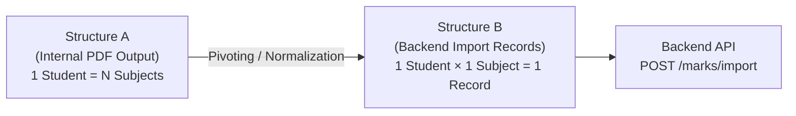

# PDF Input & Data Processing Specification

## 1. Purpose of the PDF Processing Module
The `pdf_processing` module is responsible for ingesting institutional marksheet PDF files, extracting tabular text streams and headers, normalizing records, and validating structured student marks data. 

It acts as the primary data ingestion gateway for **StudentInsight**, transforming unstructured and semi-structured PDF marksheets into clean, standardized JSON objects suitable for database persistence, analytics, and performance reporting.

---

## 2. Supported PDF Type (Version 1)
* **Supported**: **Text-based marksheet PDFs** generated directly from digital sources (e.g., word processors, spreadsheets, or college ERP systems) with selectable, machine-readable text streams and vector glyphs.
* **Not Supported in Version 1**:
  * Scanned documents or image-only PDFs (no OCR pipeline in V1).
  * Encrypted or password-protected PDF files.
  * Multi-column, non-tabular student layouts.

---

## 3. Exam-Level Fields (Header Metadata)

These fields represent institution-wide and examination-level context extracted from the primary header block on Page 1:

| Field Name | Data Type | Required? | Source / Extraction Rule | Handling if Missing |
|---|---|---|---|---|
| `institution_name` | `string` | Optional | Line 1 of document header | Leave empty or prompt user |
| `course` | `string` | **Required** | Course/degree identifier (e.g., `"B.TECH"`) | **Do NOT silently default**; flag for teacher confirmation |
| `semester` | `string` | **Required** | Semester identifier (e.g., `"II"` or `"II SEMESTER"`) | Flag for validation / teacher confirmation |
| `branch` | `string` | **Required** | Specialization/branch (e.g., `"AIML"`) | Flag for validation / teacher confirmation |
| `exam_name` | `string` | **Required** | Assessment title (e.g., `"MST-2"`) | Flag for validation / teacher confirmation |
| `exam_session` | `string` | **Required** | Examination session/month (e.g., `"JULY 2026"`) | Flag for validation / teacher confirmation |
| `maximum_marks` | `dict[str, int]` | **Required** | Dedicated row under subject codes | **Do NOT silently default** to 30 or 100; flag for teacher confirmation |
| `academic_year` | `string` | **External** | **Must be externally supplied / teacher-confirmed** (e.g., `"2025-2026"`) | **Never infer automatically** from session text |

---

## 4. Subject-Level Fields

Captured from the table column header row:

| Field Name | Data Type | Required? | Example | Rule |
|---|---|---|---|---|
| `subject_code` | `string` | **Required** | `"BT-101"`, `"BT-202"` | Alphanumeric identifier. Column order must be strictly preserved. |

---

## 5. Student-Level Fields

Extracted row-by-row across all student records:

| Field Name | Data Type | Required? | Example | Validation Rule |
|---|---|---|---|---|
| `serial_number` | `integer` | Optional | `1`, `37`, `52` | Sequential row number (`S.no`) on the marksheet. |
| `roll_number` | `string` | **Required** | `"0112AL251001"` | Alphanumeric unique identifier. Stripped of whitespace, uppercase. Must be unique across records. |
| `student_name` | `string` | **Required** | `"AASTHA SAHU"`, `"PRASHANT"` | Student full name in uppercase. Whitespace normalized. Supports variable token lengths (1 to 5 tokens). |

---

## 6. Marks Fields

Extracted from the final $N$ columns of each student row, where $N$ is the number of identified subjects:

| Value Type | Representation | Constraints |
|---|---|---|
| **Numeric Mark** | `integer` | Must be an integer such that `0 <= mark <= maximum_marks[subject_code]`. |
| **Absent Status** | `string` (`"ABS"`) | **Must remain the string `"ABS"`**. Do NOT convert absent marks to `0`, `None`, or negative values. |

---

## 7. Standard Structured JSON Output Format

The output of the processing pipeline must conform to this schema:

```json
{
  "metadata": {
    "institution_name": "BANSAL INSTITUTE OF SCIENCE AND TECHNOLOGY, BHOPAL",
    "course": "B.TECH",
    "semester": "II",
    "branch": "AIML",
    "exam_name": "MST-2",
    "exam_session": "JULY 2026",
    "academic_year": "2025-2026",
    "maximum_marks": {
      "BT-101": 30,
      "BT-202": 30,
      "BT-103": 30,
      "BT-104": 30,
      "BT-105": 30
    }
  },
  "subjects": [
    "BT-101",
    "BT-202",
    "BT-103",
    "BT-104",
    "BT-105"
  ],
  "students": [
    {
      "serial_number": 1,
      "roll_number": "0112AL251001",
      "student_name": "AASTHA SAHU",
      "marks": {
        "BT-101": 28,
        "BT-202": 23,
        "BT-103": 29,
        "BT-104": 23,
        "BT-105": 15
      }
    },
    {
      "serial_number": 9,
      "roll_number": "0112AL251015",
      "student_name": "ARYAN GIRI",
      "marks": {
        "BT-101": 30,
        "BT-202": 26,
        "BT-103": "ABS",
        "BT-104": 27,
        "BT-105": 18
      }
    }
  ]
}
```

---

## 8. Known PDF Characteristics & Parsing Nuances

From analysis of the real-world sample PDF (`college_marks.pdf` / `sample_marks.pdf`), the following physical characteristics must be handled:

1. **Multi-Page Pagination (2-Page Sample)**:
   * Page 1 contains document metadata, subject column headers, maximum marks, and student rows 1–36.
   * Page 2 continues directly with student rows 37–52.
   * **Header Absence on Subsequent Pages**: Header information and subject column titles do **not** repeat on Page 2. Parsers must either concatenate text across all pages prior to row parsing or retain subject columns from Page 1.
2. **Variable-Length Student Names**:
   * Student names vary between 1 and 5 words (e.g., single-name `"PRASHANT"` vs. multi-name `"DAKSHITA SHIVNARAYAN PURBIYA"`).
   * Fixed column index splitting will corrupt names. Tokens between the roll number and the final $N$ marks tokens must be assembled dynamically as `name = " ".join(parts[2:-N])`.
3. **Marks at the End of Row**:
   * The marks always occupy the final $N$ tokens of the parsed student row.
4. **Header Line-Wrapping**:
   * Visual table cells like `"Enrollment No"` wrap across multiple lines in raw text extraction (`"Enrollment"` on one line, `"No"` on the next). Header recognizers must account for line wrapping.

---

## 9. Important Validation Rules

1. **Roll Number Integrity**:
   * Must be present and non-empty.
   * Must be alphanumeric and stripped of extraneous whitespace.
   * Must be unique within the batch (duplicate detection must flag conflicting row indices).
2. **Student Name Integrity**:
   * Must be present, non-empty, and uppercase normalized.
3. **Subject Completeness**:
   * Every student record must contain entries for all declared subject codes.
4. **Mark Type & Value Constraints**:
   * Every mark must either be a valid integer or the exact string `"ABS"`.
   * For numeric marks, the value must satisfy: `0 <= mark <= maximum_marks[subject]`.
   * Negative marks or non-integer floats (when unexpected) must trigger validation errors.
5. **No Mutation of Absentee Data**:
   * `"ABS"` must never be coerced to `0`, `null`, or `-1`. Preserving `"ABS"` is mandatory for accurate distinction between a zero-score failure and non-attendance.

---

## 10. Fields That Must Never Be Guessed Automatically

To ensure data accuracy, prevent silent corruption, and support institutional auditing:

1. **`academic_year`**:
   * **Never infer from session string**: For example, `"JULY 2026"` must **not** be guessed as `"2025-2026"` or `"2026-2027"`. Academic calendars vary across universities. The academic year must be explicitly provided by the teacher or confirmed during import.
2. **`course`**:
   * **Do NOT silently default to `"B.TECH"`**: If the course is absent or ambiguous, flag the file for user confirmation.
3. **`maximum_marks`**:
   * **Do NOT silently default to `30` or `100`**: Max marks dictate percentage and pass/fail computations. If missing or misaligned with subject count, the extraction must halt or prompt the teacher for manual input.
4. **Missing Required Fields**:
   * Any missing required field (`course`, `semester`, `branch`, `exam_name`, `maximum_marks`, or `roll_number`) must be surfaced as a validation error or confirmation request, rather than assuming arbitrary fallbacks.

---

## 11. Output Structure Specification (Stage 1, Step 5)

The PDF-processing module defines two decoupled data representations:
1. **Structure A (Internal PDF Processing Output)**: Comprehensive, document-centric representation (wide table format).
2. **Structure B (Backend Import Mapping)**: Normalized, relational representation (long table format) for ingestion via `POST /marks/import`.



---

### Structure A: Internal PDF Processing Output

This is the canonical JSON object returned by the PDF processing pipeline. It retains document context, extracted metadata, subject column listings, and a wide-table student records structure:

```json
{
  "metadata": {
    "institution_name": "BANSAL INSTITUTE OF SCIENCE AND TECHNOLOGY, BHOPAL",
    "course": "B.TECH",
    "semester": "II",
    "branch": "AIML",
    "exam_name": "MST-2",
    "exam_session": "JULY 2026",
    "maximum_marks": {
      "BT-101": 30,
      "BT-202": 30,
      "BT-103": 30,
      "BT-104": 30,
      "BT-105": 30
    },
    "academic_year": "2025-2026"
  },
  "subjects": [
    "BT-101",
    "BT-202",
    "BT-103",
    "BT-104",
    "BT-105"
  ],
  "students": [
    {
      "serial_number": 1,
      "roll_number": "0112AL251001",
      "student_name": "AASTHA SAHU",
      "marks": {
        "BT-101": 28,
        "BT-202": 23,
        "BT-103": 29,
        "BT-104": 23,
        "BT-105": 15
      }
    },
    {
      "serial_number": 9,
      "roll_number": "0112AL251015",
      "student_name": "ARYAN GIRI",
      "marks": {
        "BT-101": 30,
        "BT-202": 26,
        "BT-103": "ABS",
        "BT-104": 27,
        "BT-105": 18
      }
    }
  ]
}
```

#### Key Rules for Structure A:
* **Preserve Document Metadata**: Contains all exam-level descriptors and per-subject maximum marks.
* **Optional / External `academic_year`**: Included when supplied externally or confirmed by the teacher.
* **Per-Student Dictionary Mapping**: `marks` is a dictionary keyed by `subject_code`.
* **Absent Values**: Absent marks **must remain the literal string `"ABS"`** (never converted to `0` or `null`).

---

### Structure B: Backend Import Mapping (`POST /marks/import`)

The backend import endpoint expects a flattened, normalized payload associated with a target database `exam_id`:

* **Endpoint**: `POST /marks/import`
* **Content-Type**: `application/json`
* **Payload Schema**:

```json
{
  "exam_id": 2,
  "max_marks": 30.0,
  "records": [
    {
      "roll_number": "0112AL251001",
      "subject_code": "BT-101",
      "marks": 28
    },
    {
      "roll_number": "0112AL251001",
      "subject_code": "BT-202",
      "marks": 23
    },
    {
      "roll_number": "0112AL251015",
      "subject_code": "BT-103",
      "marks": "ABS"
    }
  ]
}
```

---

## 12. Conversion Mechanism: Wide to Long Transformation

In the PDF and internal structure (Structure A), each student is represented by **one row** with multiple subject columns (**wide format**). 
The backend database requires **one record per student per subject** (**long/relational format**).

### Transformation Algorithm:

For each student $S$ in `students`:
$$\text{For each } (\text{subject\_code}, \text{mark}) \in S[\text{"marks"}]:$$
$$\text{Emit } \{\text{"roll\_number"}: S[\text{"roll\_number"}], \text{"subject\_code"}: \text{subject\_code}, \text{"marks"}: \text{mark}\}$$

### Concrete Example:

**Internal Student Record (Structure A)**:
```json
{
  "serial_number": 1,
  "roll_number": "0112AL251001",
  "student_name": "AASTHA SAHU",
  "marks": {
    "BT-101": 28,
    "BT-202": 23
  }
}
```

**Converts into 2 Backend Import Records (Structure B)**:
```json
[
  {
    "roll_number": "0112AL251001",
    "subject_code": "BT-101",
    "marks": 28
  },
  {
    "roll_number": "0112AL251001",
    "subject_code": "BT-202",
    "marks": 23
  }
]
```

### Absentee ("ABS") Mapping Rules:
1. **Literal Value Preserved**: If a student has `"ABS"` in an internal record (e.g., student `0112AL251015` in `BT-103`), the emitted backend record must be:
   ```json
   {
     "roll_number": "0112AL251015",
     "subject_code": "BT-103",
     "marks": "ABS"
   }
   ```
2. **No Coercion to Zero**: `"ABS"` must **not** be mapped to `0`. Converting `"ABS"` to `0` would falsely indicate that the student appeared for the test and scored zero, distorting grade distributions and attendance statistics.
3. **No Dropping of Records**: The record for an absent subject must still be sent to the backend import endpoint so the database can register the student's absence for that specific examination.

---

## 13. Errors, Warnings, and Validation Catalog (Stage 1, Step 6)

To guarantee institutional data integrity and establish clear boundaries between automated processing and human authorization, all issues detected during PDF extraction, parsing, and validation are categorized under this formal specification.

---

### 13.1. Severity Levels

| Severity Level | Definition | Impact on Pipeline | UI / Workflow Behavior |
|---|---|---|---|
| **ERROR** | A critical data integrity violation, unreadable input, or invalid value that violates core system contracts. | **Processing stops immediately** or the batch is rejected. Payload cannot be imported into the database. | Blocks persistence. Displays an error banner and requires manual correction or file re-upload. |
| **WARNING** | A condition where data is structurally parsable, but exhibits ambiguity, unusual characteristics, or missing non-critical context. | **Processing continues**, but the batch is marked as requiring teacher review. | Displays a caution banner with a dedicated preview UI allowing the teacher to inspect, confirm, or edit before final submission. |
| **INFO** | A normal, informational status message documenting successful milestone extraction and physical properties. | **Processing continues normally**. | Displayed in audit logs or summary badges. |

#### Examples of INFO Messages:
* `INFO_PDF_TYPE_DETECTED`: "Native text-based PDF detected (0 raster images, machine-readable text stream found)."
* `INFO_PAGE_COUNT`: "PDF contains 2 pages."
* `INFO_STUDENTS_DETECTED`: "52 student rows successfully detected and extracted."
* `INFO_SUBJECTS_DETECTED`: "5 subjects detected: ['BT-101', 'BT-202', 'BT-103', 'BT-104', 'BT-105']."
* `INFO_ABS_COUNT`: "5 student record(s) contain 'ABS' attendance entries."

---

### 13.2. Teacher Review Principle

> [!IMPORTANT]
> **Core Principle of Teacher Authorization**:
> 1. **No Silent Guessing**: The PDF-processing module must **never** silently guess, infer, or mutate ambiguous or missing data. 
> 2. **Pre-Import Verification**: The teacher or administrative user must always be presented with an interactive preview of the extracted metadata and student rows before records are committed to the backend database.
> 3. **Human-in-the-Loop Authority**: If any field is ambiguous (e.g., academic year, uncertain maximum marks, unusual name length), the system must highlight the item and allow the teacher to verify, provide the missing value, or make inline corrections.

---

### 13.3. Errors Catalog (Critical Conditions)

These conditions prevent the PDF from being accepted until corrected or manually resolved:

| # | Error Identifier | What It Means | Stops Pipeline? | Resolvable by Teacher Review / Correction? |
|---|---|---|---|---|
| **1** | `ERR_PDF_OPEN_FAILED` | PDF file is corrupted, password-protected, encrypted, or cannot be opened by the PDF reader. | **Yes** (immediate abort) | No — user must re-upload an unencrypted, valid PDF file. |
| **2** | `ERR_NO_EXTRACTABLE_TEXT` | PDF is scanned, raster image-only, or contains empty pages with no text glyphs. | **Yes** (immediate abort) | No — requires OCR pipeline (not supported in V1) or digital PDF upload. |
| **3** | `ERR_MISSING_EXAM_METADATA` | One or more mandatory exam-level fields (`course`, `semester`, `branch`, `exam_name`, or `exam_session`) cannot be located in the header. | **Yes** (blocks auto-import) | **Yes** — teacher can manually supply the missing metadata in the review screen. |
| **4** | `ERR_SUBJECT_HEADERS_NOT_FOUND` | Subject column headers (e.g. `BT-101`, `BT-202`) could not be detected or matched on Page 1. | **Yes** (cannot parse rows) | **Yes** — teacher can manually map or input the subject codes for the columns. |
| **5** | `ERR_NO_STUDENTS_FOUND` | No valid student data rows could be identified (e.g., regex patterns failed to match serial numbers or roll numbers). | **Yes** (empty batch) | No — PDF format does not conform to the expected template. Requires re-upload or template re-alignment. |
| **6** | `ERR_MISSING_ROLL_NUMBER` | A candidate student row has an empty, unreadable, or missing roll number token. | **Yes** (row invalid) | **Yes** — teacher can review the specific row and type in the correct roll number. |
| **7** | `ERR_MISSING_STUDENT_NAME` | A candidate student row has no name tokens between the roll number and the marks. | **Yes** (row invalid) | **Yes** — teacher can review the row and manually supply the student's name. |
| **8** | `ERR_DUPLICATE_ROLL_NUMBER` | The same roll number appears more than once in the document across student rows. | **Yes** (blocks database commit) | **Yes** — teacher can inspect conflicting rows, deduplicate, or correct typos in roll numbers. |
| **9** | `ERR_MARKS_COUNT_MISMATCH` | Number of extracted mark values for a student does not equal the number of detected subjects (e.g., 4 marks for 5 subjects). | **Yes** (row invalid) | **Yes** — teacher can inspect the row alignment and assign marks to the correct subjects. |
| **10** | `ERR_MARK_OUT_OF_RANGE` | A numeric mark is negative (`< 0`) or exceeds the subject's maximum allowed marks (`> max_marks`). | **Yes** (row invalid) | **Yes** — teacher can review the original sheet and adjust typographical score errors. |
| **11** | `ERR_INVALID_MARK_VALUE` | A mark token is neither a valid integer nor `"ABS"` (e.g. special characters like `*`, `?`, `NA`, or non-numeric strings). | **Yes** (row invalid) | **Yes** — teacher can clarify whether the value represents a score, absent, or withheld status. |
| **12** | `ERR_MISSING_SUBJECT_FOR_STUDENT` | The parsed record dictionary omits one of the mandatory subject codes declared in the header. | **Yes** (row invalid) | **Yes** — teacher can assign the missing subject entry or flag as absent. |
| **13** | `ERR_DUPLICATE_SUBJECT_CODE` | The same subject code appears multiple times in the header columns (e.g. two columns labeled `BT-101`). | **Yes** (ambiguous column mapping) | **Yes** — teacher can rename the duplicate column header (e.g. theory vs practical). |

---

### 13.4. Warnings Catalog (Review Conditions)

These conditions allow processing to continue, but the system must flag them for explicit teacher inspection:

| # | Warning Identifier | Condition Description | Impact on Processing | Required Teacher Action |
|---|---|---|---|---|
| **1** | `WARN_ACADEMIC_YEAR_ABSENT` | `academic_year` is not explicitly printed in the marksheet (only session like `"JULY 2026"` is present). | Processing continues. | Teacher must select or confirm the academic year (e.g., `"2025-2026"`) prior to database import. |
| **2** | `WARN_UNCONFIRMED_MAX_MARKS` | `maximum_marks` row is missing, incomplete, or values could not be confidently confirmed. | Processing continues using subject count. | Teacher must verify or enter the maximum marks per subject on the review screen. |
| **3** | `WARN_HEADER_STRUCTURE_VARIATION` | Header lines do not follow the standard order (e.g., branch appeared before semester, or extra college banners were found). | Metadata parser uses fuzzy matching. | Teacher reviews extracted metadata fields to confirm correct assignment. |
| **4** | `WARN_PAGINATION_NO_HEADER_REPEAT` | The PDF spans 2 or more pages and subsequent pages do not contain header or subject rows. | Processing continues using Page 1 subject mapping. | Teacher is informed that multi-page continuity was applied based on Page 1 layout. |
| **5** | `WARN_UNUSUAL_NAME_LENGTH` | A student name contains only 1 word (e.g., `"PRASHANT"`) or more than 4 words (e.g., `"DAKSHITA SHIVNARAYAN PURBIYA"`). | Row is parsed without error. | Teacher is invited to confirm that first/last names were not split or merged with adjacent numbers. |
| **6** | `WARN_ABSENT_STUDENTS_DETECTED` | One or more subjects for a student contain `"ABS"`. | `"ABS"` is preserved cleanly as a string. | Teacher is prompted with a list of absent students to confirm that attendance was marked accurately. |
| **7** | `WARN_NON_CRITICAL_METADATA_MISSING` | Non-essential metadata like `institution_name` is missing from the header. | Processing continues; `institution_name` set to `""`. | Teacher can optionally fill in the institution name or proceed without it. |
| **8** | `WARN_TABLE_EXTRACTION_ARTIFACTS` | Table extractor produced empty rows, trailing blank cells, or extra whitespace separators. | Sanitizer and cleaner automatically filter empty lines. | Teacher reviews parsed student count to ensure no valid students were dropped. |

---

## 14. Version 1 Scope (Stage 1, Step 7)

This section establishes the formal engineering boundaries for Version 1 (V1) of the `pdf_processing` module, distinguishing committed deliverables from intentionally postponed capabilities.

---

### 14.1. V1 MUST SUPPORT

Version 1 is explicitly scoped and verified to support:

1. **Text-based / machine-readable marksheet PDFs**: Native PDF documents containing digital text streams and vector glyphs.
2. **Multi-page PDFs**: Seamless text extraction across sequential document pages.
3. **Single-page headers**: Processing documents where institution metadata, exam titles, and subject columns appear **only on the first page**.
4. **Inter-page student row continuity**: Continuous parsing of student rows that flow across page breaks without repeating headers.
5. **Variable-length student names**: Dynamic tokenization handling names spanning from 1 word (`"PRASHANT"`) to 5 words (`"DAKSHITA SHIVNARAYAN PURBIYA"`).
6. **Roll/enrollment number extraction**: Locating and validating alphanumeric student identifiers (e.g., `0112AL251001`).
7. **Subject-code extraction**: Parsing declared subject codes (`BT-101`, `BT-202`, etc.) while preserving their exact column order.
8. **Numeric marks extraction**: Converting valid mark values to standard integer numbers.
9. **`"ABS"` extraction and preservation**: Recognizing absent indicators and preserving `"ABS"` as an immutable string throughout the pipeline.
10. **Maximum-marks extraction**: Extracting per-subject maximum marks when explicitly declared in the header.
11. **Exam metadata extraction**: Parsing primary context fields:
    - `institution_name`
    - `course`
    - `semester`
    - `branch`
    - `exam_name`
    - `exam_session`
12. **Teacher confirmation of uncertain/missing metadata**: Interactive fallback allowing manual review and input when metadata fields are missing or ambiguous.
13. **Comprehensive validation**:
    - Duplicate roll numbers
    - Missing required fields
    - Marks count matching subject count
    - Marks within valid range ($0 \le \text{mark} \le \text{max\_marks}$)
    - Unrecognized/invalid mark values
    - Missing subjects per student
    - Duplicate subject codes in headers
14. **Internal standardized JSON output (Structure A)**: Emitting wide-format document payloads with metadata and student mark maps.
15. **Wide-to-long mapping for backend import**: Pivoting internal multi-subject student rows into flat, relational records.
16. **Teacher preview and verification**: Ensuring human review is required before committing extracted batches to storage.
17. **Backend mapping compatibility**: Emitting payload structures directly matching the `POST /marks/import` schema (`exam_id`, `max_marks`, `records`).
18. **Pipeline-wide `"ABS"` immutability**: Guaranteeing that `"ABS"` is never coerced to `0`, `null`, or `-1` across extractor, parser, cleaner, validator, and mapper.

---

### 14.2. V1 SHOULD NOT SUPPORT (Intentionally Postponed)

The following features are intentionally out of scope for Version 1 to prevent scope creep and maintain reliability:

1. **OCR / scanned image PDFs**: No integration of Tesseract, PyTesseract, or raster image preprocessing in V1.
2. **Handwritten marksheets**: No optical character recognition for handwritten grades or notes.
3. **Automatic correction of uncertain data**: No heuristic guessing of ambiguous student names, roll numbers, or corrupted marks.
4. **Automatic guessing of academic year**: Academic year must never be guessed from session strings like `"JULY 2026"`; it must be externally supplied or teacher-confirmed.
5. **Automatic guessing of missing maximum marks**: Missing max marks must not be silently defaulted to 30 or 100.
6. **Automatic guessing of missing course/branch information**: Missing courses must not be defaulted to `"B.TECH"`.
7. **Complex PDFs with highly irregular layouts**: Free-form, multi-column narrative reports or non-tabular layouts that cannot be reliably parsed.
8. **Image-based tables requiring computer vision**: Tables embedded solely as bitmap screenshots without vector paths.
9. **Automatic database insertion without teacher verification**: Zero uninspected direct writes to production marks tables.
10. **Advanced ML-based extraction**: No deep learning models (LayoutLM, Donut, etc.) in the initial release.

---

### 14.3. Future Enhancements (Roadmap)

Planned capabilities for subsequent development phases:

* **OCR pipeline integration**: Optical Character Recognition support for scanned paper marksheets and image-based PDFs.
* **Multi-template recognition**: Automated classification and parsing across diverse university marksheet layouts.
* **Layout auto-detection**: Intelligent layout detection distinguishing between tabular grids and key-value formats.
* **Resilient table reconstruction**: Advanced graph- or line-based table extraction for borderless or irregular tables.
* **Confidence scoring**: Per-field probability scores indicating extraction certainty to guide teacher review.
* **ML-assisted field extraction**: Machine learning models trained on diverse institutional transcripts.
* **Automated anomaly detection**: Statistical highlighting of anomalous class mark distributions or sudden outlier drops.
* **Flexible grading formats**: Native support for letter grades (`A+`, `B`, `F`), grade points, and practical/theory split marks.

---

### 14.4. V1 Success Criteria

Version 1 does **not** claim universal 100% accuracy on every arbitrary document. Instead, V1 achieves practical success by delivering **reliable, verifiable, and transparent extraction on supported text-based formats**.

For the benchmark marksheet PDF (`college_marks.pdf` / `sample_marks.pdf`), Version 1 successfully:

- [x] Opens and reads the PDF file streams without error.
- [x] Detects that the document is native text-based (0 raster images).
- [x] Detects exactly 2 pages.
- [x] Detects exactly 5 declared subjects (`BT-101`, `BT-202`, `BT-103`, `BT-104`, `BT-105`).
- [x] Detects and extracts all 52 student rows across both pages.
- [x] Extracts student roll numbers accurately (e.g., `0112AL251001` through `0112AL251078`).
- [x] Extracts student names of variable lengths (1 to 4 words).
- [x] Extracts all subject marks per student with exact subject alignment.
- [x] Preserves `"ABS"` as an explicit string for all 5 absent students.
- [x] Validates every student record against integrity and range rules.
- [x] Generates the standardized internal JSON document (Structure A).
- [x] Converts internal records into relational import records matching `POST /marks/import` (Structure B).
- [x] Enforces a teacher verification gate before committing records to the database.

---

### 14.5. Final V1 Boundary Statement

> **Version 1 is intentionally focused on reliable processing of structured, text-based marksheet PDFs. It prioritizes correctness, validation, transparency, and teacher verification over supporting every possible PDF format.**

---

## 15. Stage 1 Milestone Completion Status

With the completion of Steps 1 through 7, **Stage 1 (PDF Inspection, Specification & Architectural Contracts)** is officially **COMPLETE**:

- **Step 1: Inspect Sample PDF Format** — Complete (verified native text-based, 2 pages, 52 students).
- **Step 2: Inspect Table & Text Extraction Behavior** — Complete (verified `pdfplumber` text streams and grid vector lines).
- **Step 3: Define Exact Data Fields to Extract** — Complete (formalized metadata, subject, student, and mark fields).
- **Step 4: Create PDF Input Specification Document** — Complete (created [`pdf_processing/PDF_INPUT_SPECIFICATION.md`](PDF_INPUT_SPECIFICATION.md)).
- **Step 5: Formally Define Output Structure & Backend Mapping** — Complete (specified Structure A, Structure B, and wide-to-long transformation).
- **Step 6: Identify Errors and Warnings** — Complete (established Severity Levels, Teacher Review Principle, 13 Errors, and 8 Warnings).
- **Step 7: Define Version 1 Scope & Boundaries** — Complete (formalized V1 Must Support, Should Not Support, Future Roadmap, and Success Criteria).


